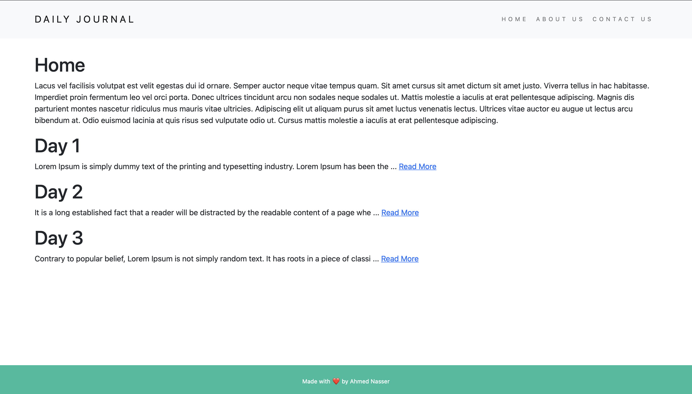
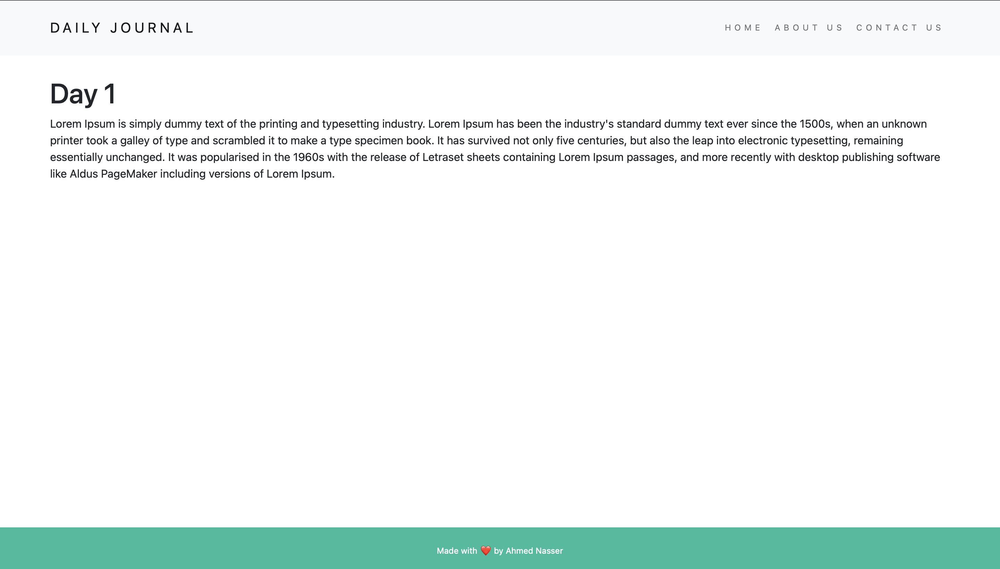
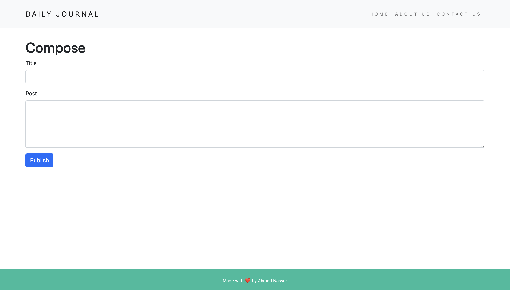

# Blog

## Description

This is a simple personal blog website. the main purpose of this project is to learning and practicing web development.

## Tools and Technologies

This project was built using the following technologies:

- **Node.js** is an open-source, cross-platform, back-end JavaScript runtime environment that runs on the V8 engine and executes JavaScript code outside a web browser.
- **Express.js** is a web application framework for Node.js, which is a minimal and flexible Node.js web application framework designed for building web applications and APIs.
- **MongoDB** is an open source NoSQL database management program. NoSQL is used as an alternative to traditional relational databases. NoSQL databases are quite useful for working with large sets of distributed data. MongoDB is a tool that can manage document-oriented information, store or retrieve information.
- **Ejs** is a templating engine for Node.js.

## Sample GIF

1. Home page



2. Post page



3. Compose page



## Project Structure

```
.
├── README.md
├── package-lock.json
├── package.json
├── app.js
├── database
│   ├── database.js
│   └── postModel.js
├── public
│   └── css
│       └── styles.css
├── routes
│   ├── about.js
│   ├── compose.js
│   ├── contact.js
│   ├── home.js
│   └── post.js
└── views
    ├── about.ejs
    ├── compose.ejs
    ├── contact.ejs
    ├── footer.ejs
    ├── header.ejs
    ├── home.ejs
    └── post.ejs

```

## Installation

1. In order to run the project, you need to install the following:
   [MongoDB](https://docs.mongodb.com/manual/installation/)
   [Node.js](https://nodejs.org/en/download/)

2. Clone the project from github

```bash
> git clone https://github.com/AhmedNasserG/Blog.git
```

3. Run `npm i` command in the project folder
4. Run `node app.js` (to launch the server)
